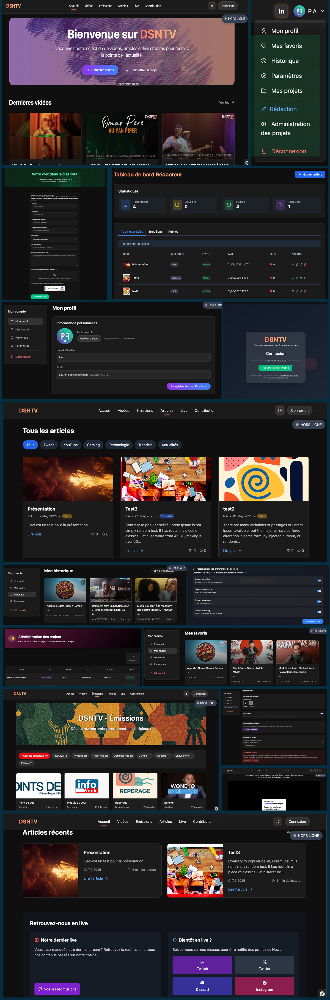

# projet_stage_dsntv
# DSNTV – Plateforme média communautaire (extrait de projet)

Ce dépôt contient une sélection de fichiers issus du développement de la plateforme DSNTV, réalisé dans le cadre de mon stage de fin de formation Développeur Web & Web Mobile (DWWM).

> 🔒 Pour des raisons de confidentialité, seule une partie du code est présente ici. L’ensemble du projet est toujours en développement au sein de l’entreprise.

---

## 📌 Projet en bref

- **Client** : DSNTV (branche média de Baifall Dream)
- **Objectif** : Créer une plateforme web dédiée à la diaspora sénégalaise (vidéos, lives, articles)
- **Durée** : Stage de 2 mois, en binôme
- **Technos principales** : Symfony, Twig, Tailwind, Webpack Encore

---

## 🧠 Ce que j’ai réalisé

- Mise en place complète avec **Symfony** (architecture MVC, routing, controllers)
- Mise en place de la base de données relationnelle avec **MySQL**
- Utilisation de **Doctrine ORM** pour la modélisation et les requêtes
- Création des entités, relations et contraintes via **Symfony**
- Génération des schémas et gestion des versions via **migrations Doctrine**
- Authentification via **Google OAuth2**
- Pages : accueil, émissions, RGPD, compte utilisateur, connexion
- Modules dynamiques : **favoris, historique, formulaire de contact**
- Intégration de **Twig** avec Webpack Encore
- Sécurisation avancée : CSRF, reCAPTCHA, headers HTTP et utilisation de bundle Nelmio security
- Responsive design avec **Tailwind CSS**
- Collaboration via **Trello**, wireframing, maquettes Figma

---

## 🛠️ Stack technique

- **Symfony 6** (routing, controller, service)
- **Twig** pour le templating dynamique
- **Webpack Encore** pour la compilation des assets
- **Tailwind CSS** pour le design
- **OAuth2 Google** via `KnpUOAuth2ClientBundle`
- **PHPMailer** et **reCAPTCHA v3**
- **Doctrine ORM**, migrations
- Javascript pour la mise ne place de certaines fonctionnalités

---

## ✨ Compétences acquises

- Prise en main de **Symfony** et de son architecture
- Gestion de projet en binôme, autonomie technique
- Intégration d’**APIs externes** (OAuth2, reCAPTCHA)
- Sécurité web (CSRF, XSS, Content-Security-Policy)
- Utilisation professionnelle de **Git/GitHub** (branches, versions)

---

## 🖼️ Aperçu (maquette)

---

## 📂 Contenu du dépôt

- `/controllers` → exemples de controllers utilisateur (favoris, historique…)
- `/templates` → extraits de vues Twig (accueil, formulaire, compte)
- `/services` → logique de validation, sécurité, Google OAuth2

---

## 📫 Contact

- [Portfolio personnel](https://paulfenelon.fr)
- [Email](mailto:dev@paulfenelon.fr)
 
